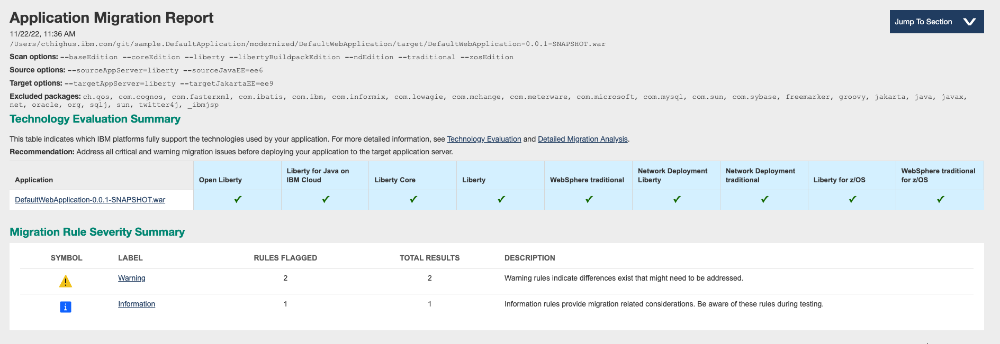
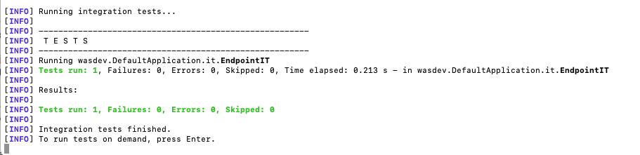
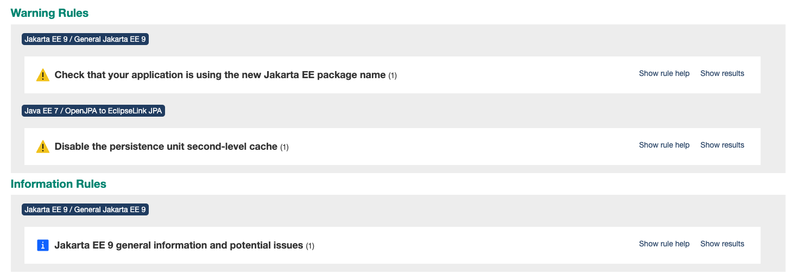
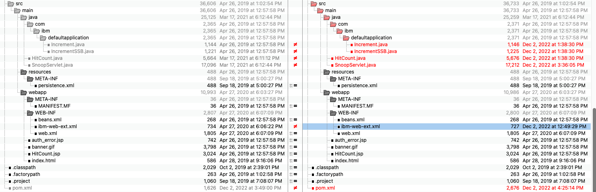
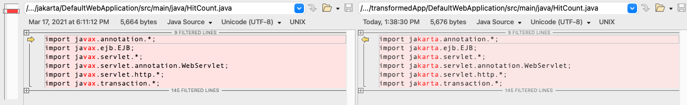

# Modernizing DefaultApplication to Jakarta EE 9.1

WORK IN PROGRESS

In the [first phase of DefaultApplication modernization](../README.md), we moved a complex traditional WebSphere Application Server application to Liberty. In this article, we will upgrade the application to use Jakarta EE.

- Review the application: where are we coming from and where do we want to go to.
  -	What are the commands to run for the modernized branch
		    mvn clean install
		    mvn liberty:dev
  - Decide which Java version we want to run
  - Run the binary scanner - and go over the results
	 - View the evaluation report and migration issues
	 - view the migration issues
- Copy the code 
- Modernize to the latest liberty-maven-plugin
- Running the Eclipse transformer to make the package changes
- Testing and running the result.
- Reviewing the Evaluation report

## Review

### Starting from the modernized folder

* Scanned the existing war file
* Scanned the ear file

* Create a new Jakarta folder
* Clean the “modernized” folder
* Copy all remaining files from “modernized” to “Jakarta”
* Tried to start the application in devMode from the ear project

        mvn liberty:dev
        [ERROR] Failed to execute goal io.openliberty.tools:liberty-maven-plugin:3.3.4:dev (default-cli) on project DefaultApplication: CWWKM2173E: Failed to install application from project DefaultApplication:DefaultApplication:pom:0.0.1-SNAPSHOT. The project packaging type is not supported. -> [Help 1]
        [ERROR]
        [ERROR] To see the full stack trace of the errors, re-run Maven with the -e switch.
        [ERROR] Re-run Maven using the -X switch to enable full debug logging.
        [ERROR]
        [ERROR] For more information about the errors and possible solutions, please read the following articles:
        [ERROR] [Help 1] http://cwiki.apache.org/confluence/display/MAVEN/MojoExecutionException

- Download a starter project from openliberty.io to get the latest recommendations for the liberty-maven-plugin config

- Worked on the pom.xml for multi-module support (where did I get the example?).

- With Java 17 is installed:

       [INFO] [AUDIT   ] CWWKS4104A: LTPA keys created in 0.633 seconds. LTPA key file: /Users/cthighus.ibm.com/git/sample.DefaultApplication/jakarta/DefaultApplication-ear/target/liberty/wlp/usr/servers/DefaultApplicationServer/resources/security/ltpa.keys
       [INFO] [WARNING ] [ TargetsTableImpl@f9e1ed9 ] ANNO_TARGETS_SCAN_EXCEPTION [ java.io.Serializable ] (java.lang.IllegalArgumentException: Unsupported class file major version 62
       [INFO] 	at org.objectweb.asm.ClassReader.<init>(ClassReader.java:189)
       [INFO] 	at [internal classes]
       [INFO]  : Unsupported class file major version 62)
       [INFO] [WARNING ] Scan exception
       [INFO] Unsupported class file major version 62
       [INFO] [WARNING ] [ TargetsTableImpl@f9e1ed9 ] ANNO_TARGETS_SCAN_EXCEPTION [ java.lang.Object ] (java.lang.IllegalArgumentException: Unsupported class file major version 62
       [INFO] 	at org.objectweb.asm.ClassReader.<init>(ClassReader.java:189)
       [INFO] 	at [internal classes]
       [INFO]  : Unsupported class file major version 62)
       [INFO] [WARNING ] Scan exception
       [INFO] Unsupported class file major version 62
       [INFO] [WARNING ] [ TargetsTableImpl@f9e1ed9 ] ANNO_TARGETS_SCAN_EXCEPTION [ java.lang.annotation.Annotation ] (java.lang.IllegalArgumentException: Unsupported class file major version 62
       [INFO] 	at org.objectweb.asm.ClassReader.<init>(ClassReader.java:189)
       [INFO] 	at [internal classes]
       [INFO]  : Unsupported class file major version 62)
       [INFO] [WARNING ] Scan exception
       [INFO] Unsupported class file major version 62
       [INFO] [WARNING ] ANNO_CLASSINFO_SCAN_EXCEPTION
       [INFO]                                                                                                                ClassInfoCacheImpl@653d45a7
       [INFO]                    

- Java 11 runs OK

- I re-enabled file serving and open the application at http://localhost:9080/

- Server.xml:  At Java EE 8 level.

       <?xml version="1.0" encoding="UTF-8"?>
       <server description="DefaultApplication server">

          <!-- Enable features -->
          <featureManager>
              <feature>appSecurity-2.0</feature>
              <feature>ejbLite-3.2</feature>
              <feature>jdbc-4.2</feature>
              <feature>jsp-2.3</feature>
              <feature>servlet-4.0</feature>
              <feature>jpa-2.2</feature>
          </featureManager>

          <!-- Encoded password can be generated using bin/securityUtility -->
          <keyStore password="change1me"/>

          <basicRegistry id="basic" realm="BasicRealm">
              <user name="user1" password="change1me"/>
              <group name="All Role">
          	      <member name="user1"/>
              </group>
          </basicRegistry>

          <!-- To access this server from a remote client add a host attribute to the following element, e.g. host="*" -->
          <httpEndpoint id="defaultHttpEndpoint"
                  host="*"
                  httpPort="9080"
                  httpsPort="9443" />

          <enterpriseApplication id="DefaultApplication" location="DefaultApplication.ear" name="DefaultApplication"/>

          <jdbcDriver id="DerbyEmbedded" libraryRef="DerbyLib" />
          <library id="DerbyLib" filesetRef="DerbyFileset" />
          <fileset id="DerbyFileset"
                   dir="${shared.resource.dir}"
                   includes="derby-10.13.1.1.jar" />

          <dataSource id="DefaultDatasource"
                   jndiName="DefaultDatasource"
                   jdbcDriverRef="DerbyEmbedded">
              <properties.derby.embedded
                  databaseName="${shared.resource.dir}DefaultDB"
                  createDatabase="false" />
          </dataSource>
      </server>

## Running the Eclipse Transformer

https://openliberty.io/blog/2021/03/17/eclipse-transformer.html
https://projects.eclipse.org/projects/technology.transformer

1. mvn clean - to get rid of all binaries
2. java -jar org.eclipse.transformer.cli-0.6.0-SNAPSHOT.jar ~/git/sample.DefaultApplication/jakarta/  ./transformedApp
3. Followed the instructions to download the Open Liberty rules and re-ran transform, but it failed (need to talk to Tom)

       jakartaMigrationDefaultApplication $ java -jar org.eclipse.transformer.cli-0.6.0-SNAPSHOT.jar ~/git/sample.DefaultApplication/jakarta/  ./transformedAppWithRules -tr ./rules/jakarta-renames.properties  -dt ./rules/jakarta-direct.properties -tf ./rules/jakarta-xml-dd.properties
       jakartaMigrationDefaultApplication $ java -jar org.eclipse.transformer.cli-0.6.0-SNAPSHOT.jar ~/git/sample.DefaultApplication/jakarta/  ./transformedAppWithRules -tr ./rules/jakarta-renames.properties  -dt ./rules/jakarta-direct.properties -tf ./rules/jakarta-xml-dd.properties
       Copyright (c) Contributors to the Eclipse Foundation
       org.eclipse.transformer.cli.JakartaTransformerCLI Version [ 0.6.0-SNAPSHOT ]

       [main] INFO Transformer - Input [ /Users/cthighus.ibm.com/git/sample.DefaultApplication/jakarta ]
       [main] INFO Transformer - Output [ /Users/cthighus.ibm.com/Downloads/jakartaMigrationDefaultApplication/transformedAppWithRules ]
       [main] INFO Transformer - Properties [ RULES_SELECTIONS ] URL [ jar:file:/Users/cthighus.ibm.com/Downloads/jakartaMigrationDefaultApplication/libs/org.eclipse.transformer.jakarta-0.6.0-SNAPSHOT.jar!/org/eclipse/transformer/jakarta/jakarta-selection.properties ]
       [main] INFO Transformer - Properties [ RULES_RENAMES ] URL [ file:/Users/cthighus.ibm.com/Downloads/jakartaMigrationDefaultApplication/rules/jakarta-renames.properties ]
       [main] INFO Transformer - Properties [ RULES_VERSIONS ] URL [ jar:file:/Users/cthighus.ibm.com/Downloads/jakartaMigrationDefaultApplication/libs/org.eclipse.transformer.jakarta-0.6.0-SNAPSHOT.jar!/org/eclipse/transformer/jakarta/jakarta-versions.properties ]
       [main] INFO Transformer - Properties [ RULES_BUNDLES ] URL [ jar:file:/Users/cthighus.ibm.com/Downloads/jakartaMigrationDefaultApplication/libs/org.eclipse.transformer.jakarta-0.6.0-SNAPSHOT.jar!/org/eclipse/transformer/jakarta/jakarta-bundles.properties ]
       [main] INFO Transformer - Properties [ RULES_DIRECT ] URL [ jar:file:/Users/cthighus.ibm.com/Downloads/jakartaMigrationDefaultApplication/libs/org.eclipse.transformer.jakarta-0.6.0-SNAPSHOT.jar!/org/eclipse/transformer/jakarta/jakarta-direct.properties ]
       [main] INFO Transformer - Properties [ RULES_MASTER_TEXT ] URL [ file:/Users/cthighus.ibm.com/Downloads/jakartaMigrationDefaultApplication/rules/jakarta-xml-dd.properties ]
       [main] INFO Transformer - Package renames are in use
       [main] INFO Transformer - Package versions will be updated
       [main] INFO Transformer - Bundle identities will be updated
       [main] ERROR Transformer - Exception loading rules:
       java.io.IOException: Resource [ rules/class=%22js-stale-session-flash-signed-out%22%20hidden%3EYou%20signed%20out%20in%20another%20tab%20or%20window.%20%3Ca%20href=%22%22%3EReload%3C/a%3E%20to%20refresh%20your%20session.%3C/span%3E ] not found on [ org.eclipse.transformer.jakarta.JakartaTransform$$Lambda$3/0x00000000c3f9a2e0@d6800c2 ]
	      at org.eclipse.transformer.Transformer.loadProperties0(Transformer.java:633)
	       at org.eclipse.transformer.Transformer.lambda$loadSubstitutions$2(Transformer.java:706)
	        at aQute.bnd.exceptions.BiFunctionWithException.lambda$orElseThrow$0(BiFunctionWithException.java:22)
	         at java.base/java.util.stream.ReduceOps$1ReducingSink.accept(ReduceOps.java:80)
	          at java.base/java.util.ArrayList$ArrayListSpliterator.forEachRemaining(ArrayList.java:1625)
	           at java.base/java.util.stream.AbstractPipeline.copyInto(AbstractPipeline.java:522)
	            at java.base/java.util.stream.AbstractPipeline.wrapAndCopyInto(AbstractPipeline.java:512)
	             at java.base/java.util.stream.ReduceOps$ReduceOp.evaluateSequential(ReduceOps.java:921)
	              at java.base/java.util.stream.AbstractPipeline.evaluate(AbstractPipeline.java:239)
	               at java.base/java.util.stream.ReferencePipeline.reduce(ReferencePipeline.java:667)
	                at org.eclipse.transformer.Transformer.loadSubstitutions(Transformer.java:700)
	                 at org.eclipse.transformer.Transformer.setRules(Transformer.java:374)
	                  at org.eclipse.transformer.Transformer.basicRun(Transformer.java:171)
	                   at org.eclipse.transformer.Transformer.run(Transformer.java:156)
	                    at org.eclipse.transformer.cli.TransformerCLI.run(TransformerCLI.java:387)
	                     at org.eclipse.transformer.cli.TransformerCLI.runWith(TransformerCLI.java:58)
	                      at org.eclipse.transformer.cli.JakartaTransformerCLI.main(JakartaTransformerCLI.java:24)
                        [main] INFO Transformer - Transformer Return Code [ 2 ] [ Rules Error ]
                        jakartaMigrationDefaultApplication $ java -jar org.eclipse.transformer.cli-0.6.0-SNAPSHOT.jar ~/git/sample.DefaultApplication/jakarta/  ./transformedAppWithRules -tr ./rules/jakarta-renames.properties  -dt ./rules/jakarta-direct.properties -tf ./rules/jakarta-xml-dd.properties

The Eclipse Transformer does not change files in place
I copied 5 Java files left

src/main/java/HitCount.java
src/main/java/SnoopServlet.java
src/main/java/com.ibm.defaultapplication.Increment.java
src/main/java/com.ibm.defaultapplication.IncrementSSB.java
pom.xml

Here is an example of the Java changes made:

Using the table found here https://openliberty.io/blog/2021/03/17/eclipse-transformer.html, I manually updated the feature list

    <featureManager>
        <feature>appSecurity-4.0</feature>
        <feature>enterpriseBeansLite-4.0</feature>
        <feature>jdbc-4.2</feature>
        <feature>pages-3.0</feature>
        <feature>servlet-5.0</feature>
        <feature>persistence-3.0</feature>
    </featureManager>

mvn clean package

[ERROR] Failed to execute goal on project DefaultWebApplication: Could not resolve dependencies for project DefaultApplication:DefaultWebApplication:war:2.0-SNAPSHOT: Could not find artifact jakarta.persistence:jakarta.persistence-api:jar:2.2 in central (https://repo.maven.apache.org/maven2) -> [Help 1]

Notice that this dependency was not updated, so I manually updated it

        <dependency>
            <groupId>javax</groupId>
            <artifactId>javaee-api</artifactId>
            <version>7.0</version>
            <scope>provided</scope>
        </dependency>

Replace with this:
         <dependency>
           <groupId>jakarta.platform</groupId>
           <artifactId>jakarta.jakartaee-web-api</artifactId>
           <version>10.0.0</version>
           <scope>provided</version>
        </dependency>

The version was not updated on this, so I set it to 3.1.0
        <dependency>
            <groupId>jakarta.persistence</groupId>
            <artifactId>jakarta.persistence-api</artifactId>
            <version>2.2</version>
            <scope>provided</scope>
        </dependency>

I was compiling against a Jakarta 10 api which (maybe) HttpUtils is removed?  This is OK for Jakarta 9.1 *********

I had to change
//              out.println("<tr><td>" + escapeChar(HttpUtils.getRequestURL(req).toString()) + "</td></tr></table>  ");
                out.println("<tr><td>" + escapeChar(req.getRequestURL().toString()) + "</td></tr></table>  ");

Ear pom.xml

Had to change                     

		<assemblyArtifact>
                        <groupId>com.ibm.websphere.appserver.runtime</groupId>
                        <artifactId>wlp-javaee8</artifactId>
                        <version>21.0.0.1</version>
                        <type>zip</type>
                    </assemblyArtifact>

To

                    <assemblyArtifact>
                      <groupId>com.ibm.websphere.appserver.runtime</groupId>
                      <artifactId>wlp-jakartaee9</artifactId>
                      <version>22.0.0.12</version>
                      <type>zip</type>
                    </assemblyArtifact>

Simplified the DefaultApplication-ear pom.xml

Removed:
            <!--plugin>
                <groupId>io.openliberty.tools</groupId>
                <artifactId>liberty-maven-plugin</artifactId>
                <version>3.6.1</version>
                <configuration>
                    <assemblyArtifact>
                      <groupId>com.ibm.websphere.appserver.runtime</groupId>
                      <artifactId>wlp-jakartaee9</artifactId>
                      <version>22.0.0.12</version>
                      <type>zip</type>
                    </assemblyArtifact>
                    <serverName>${liberty.server.name}</serverName>
                    <configFile>src/main/liberty/config/server.xml</configFile>
                    <appsDirectory>apps</appsDirectory>
                    <looseApplication>false</looseApplication>
                </configuration>
            </plugin -->
