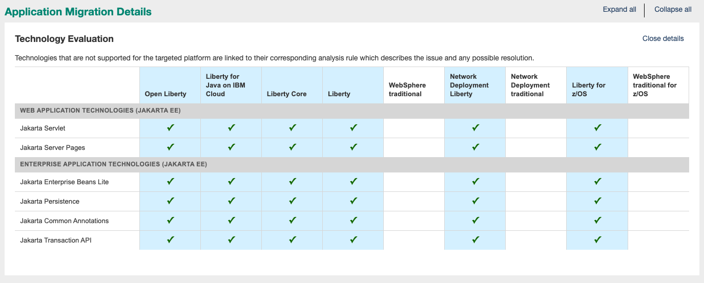

# Modernizing DefaultApplication to Jakarta EE 10

As promised in the [Jakarta 9 modernization article](../jakarta9/README.md), Jakarta 10 has arrived, and we are revisiting this DefaultApplication example. There are some small modifications needed to run using Jakarta 10.  If you want to use this applicaiton for testing, there is a [prebuilt application](https://github.com/WASdev/sample.DefaultApplication/blob/main/jakarta10/PrebuiltApplication/DefaultApplication.ear).

Since we have already done the package renames, the process is easier this time around to move from Jakarta 9 to Jakarta 10. I also copied the code from the [jakarta9](../jakarta9) folder to the [jakarta10](../jakarta10/) folder to show this modernization separately. We will

- [Review the application](#review-the-application)
- [Modernize the code](#modernize-the-code)
- [Test the result](#test-the-result)
- [Review the Technology Evaluation report](#review-the-binary-scanner-reports)

## Review the application

### Starting from the jakarta9 folder

Let's start with the Jakara 9 version of the application which I copied to the jakarta10 folder. 

First, we will clean things up and make sure they build in the [jakarta10](../jakarta10) folder.

    mvn clean install

Building the existing application allows us to scan the EAR file using the [binary scanner](https://www.ibm.com/support/pages/node/6250961#asset/tools-Migration_Toolkit_for_Application_Binaries) to give us insights to help with the decisions.

### Scan the application with the binary scanner

We already set up the pom.xml file to run the binary scanner. In order to scan for Jakarta 10 changes, we will need a few changes to our pom.xml configuration.  Since we already moved to Java 17, set the property `--sourceJava=ibm17`. To do the Jakarta 10 scan, change `--sourceJavaEE=ee8` to `--sourceJakartaEE=ee9`.  Also update target Jakarta EE level to be  `--targetJakartaEE=ee10`. The new binary scanner support for Jakarta 10 was released in v23.0.0.1, so you should set the version to at least `23.0.0.1`. We always recommend using the latest.

```xml
            <plugin>
              <groupId>org.codehaus.mojo</groupId>
              <artifactId>exec-maven-plugin</artifactId>
              <version>3.0.0</version>
              <executions>
                <execution>
                <goals>
                  <goal>java</goal>
                  </goals>
                </execution>
              </executions>
              <configuration>
                <includePluginDependencies>true</includePluginDependencies>
                <mainClass>com.ibm.ws.report.binary.cmdline.DriveScan</mainClass>
                <addOutputToClasspath>false</addOutputToClasspath>
                <arguments>
                  <argument>${project.basedir}/DefaultApplication-ear/target/DefaultApplication.ear</argument>
                  <argument>--all</argument>
                  <argument>--sourceAppServer=liberty</argument>
                  <argument>--sourceJava=ibm17</argument>
                  <argument>--targetJava=java17</argument>
                  <argument>--sourceJavaEE=ee9</argument>
                  <argument>--targetJakartaEE=ee10</argument>
                  <argument>--nobrowser</argument>
                  <argument>--scanAll</argument>
                  <argument>--output=${project.build.directory}</argument>
                </arguments>
              </configuration>
              <dependencies>
                <dependency>
                  <groupId>com.ibm.websphere.appmod.tools</groupId>
                  <artifactId>binary-app-scanner</artifactId>
                  <version>22.0.0.7</version>
                  <type>jar</type>
                </dependency>
              </dependencies>
            </plugin>

```
After setting up the pom.xml, scan the application by running the following commands:

```bash
mvn exec:java
open ./target/DefaultApplication.ear_MigrationReport.html
```
The following report shows one critical and two informational messages for Jakarta EE 10. 


The Technology Evaluation report shows the Jakarta EE technologies currently used by the application. 




## Modernize the code

### Java code updates 

Looking at the results for the critical issue, you can see that [SnoopServlet.java](./DefaultWebApplication/src/main/java/SnoopServlet.java) uses a method from `jakarta.servlet.http.HttpUtils` that was removed. 


The rule help guides us to change
```java
 out.println("<tr><td>" + escapeChar(HttpUtils.getRequestURL(req).toString()) + "</td></tr></table><BR><BR>");
```
to 
```java
 out.println("<tr><td>" + escapeChar(req.getRequestURL().toString()) + "</td></tr></table><BR><BR>");
```
This update eliminates the Jakarta 10 critical issue. Remember that if you want to rerun the binary scanner, you need to rebuild the EAR file. This solution does not use anything new in Jakarta 10, and we are still compiling against Jakarta 9 dependencies.


### pom.xml updates

To compile against Jakarta 10 APIs, we need to update the pom.xml dependency found in the [DefaultWebApplication pom file](./DefaultWebApplication/pom.xml)

We just need to update the version from 9.1.0 to 10.0.0.

```xml
        <dependency>
            <groupId>jakarta.platform</groupId>
            <artifactId>jakarta.jakartaee-api</artifactId>
            <version>10.0.0</version>
            <scope>provided</scope>
        </dependency>
```
With the code change already made, the application compiles cleanly with this new dependency. When I changed this dependency before making the code update, I got this error:

```bash
[ERROR] Failed to execute goal org.apache.maven.plugins:maven-compiler-plugin:3.1:compile (default-compile) on project DefaultWebApplication: Compilation failure
[ERROR] /Users/cthighus.ibm.com/git/sample.DefaultApplication/jakarta10/DefaultWebApplication/src/main/java/SnoopServlet.java:[56,53] cannot find symbol
[ERROR]   symbol:   variable HttpUtils
[ERROR]   location: class SnoopServlet
[ERROR] 

```

#### server.xml Feature updates

Next, I need to make server.xml changes so that I use Jakarta EE 10 features. The binary scanner helps you make those updates as well. If you look at the generated report, the bottom section includes Liberty Configuration.


Since we are running analysis against a Liberty application, the binary scanner just creates a feature list for the application using the target Jakarata EE level which shows you how to update the feature versions to move from Jakarta EE 9.1 to Jakarta 10. 

Notice that the jdbc feature is not included in the feature list above. `persistence-3.1` automatically enables `jdbc-4.3`, so we do not have to explicitly add it to the list. (I removed it.)


## Test the result

With these changes in place, run Liberty dev mode on this multi-module project using the following command:

    mvn liberty:dev

There is one integration test and it is passing.


To view the application, open the browser at http://localhost:9080/


