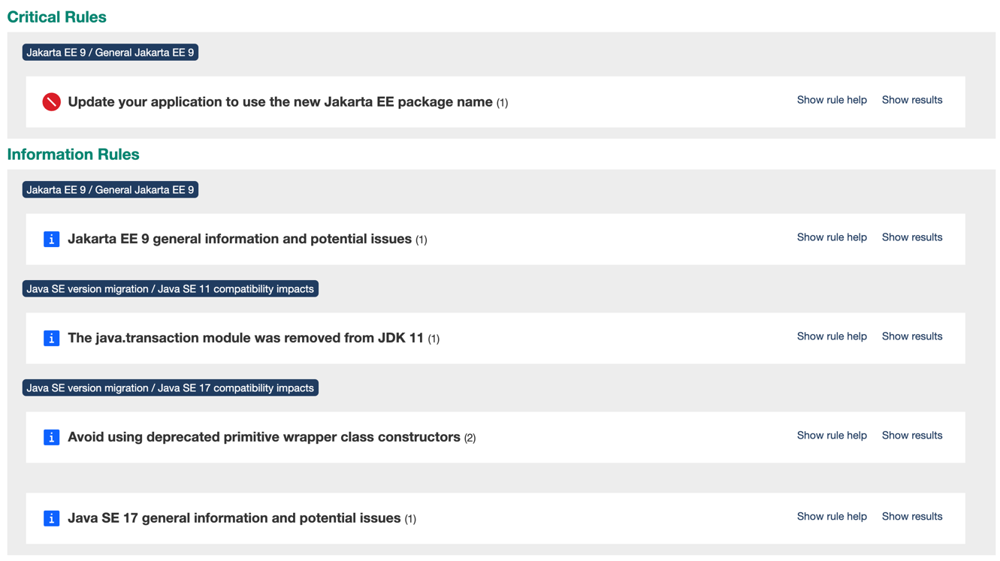
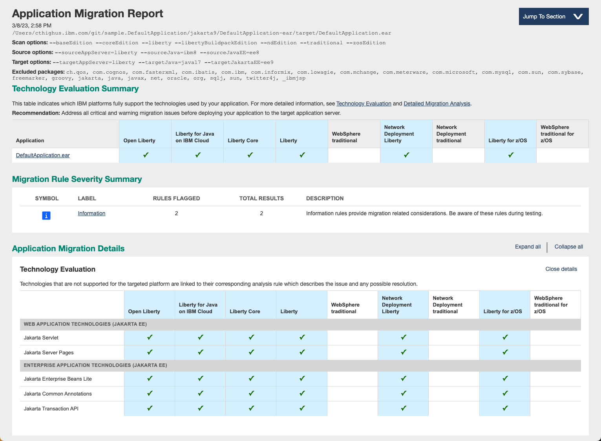

# Modernizing DefaultApplication to Jakarta EE 9.1

Note: This article was updated to show use of the latest binary scanner v23.0.0.1.

When we first [modernized DefaultApplication](../README.md), we moved a complex, traditional WebSphere Application Server application to Liberty. In this post, we will upgrade the same application to use Jakarta EE 9.1.

Here is an outline of the step-by-step process we went through to do the modernization.

- [Review the application](#review-the-application)
- [Modernize the code](#modernize-the-code)
  - Copy the code
  - Make pom.xml updates
  - Run the Eclipse transformer
- [Test the result](#test-the-result)
- [Review the Technology Evaluation report](#review-the-binary-scanner-reports)

## Review the application

### Starting from the modernized folder

Let's take a look at the application as it exists today and decide how far we want to take this step of modernization. We want to move to Jakarta 9 which can run on Java SE 8 or higher. Should we move on up to Java SE 11 or Java SE 17 at the same time?

Building the existing application allows us to scan the EAR file using the [binary scanner](https://www.ibm.com/support/pages/node/6250961#asset/tools-Migration_Toolkit_for_Application_Binaries) to give us insights to help with the decisions.

Create the EAR file in the `modernized` application by running the following command from the [modernized](../modernized) folder.

    mvn clean install

### Scan the application with the binary scanner

The binary scanner was updated recently with support for Jakarta 9 migration rules. At this time Jakarta 10 is in beta for Liberty. We will focus on the initial hop from Java EE to Jakarta EE 9.1. The following command scans for Jakarta 9.1 differences and allows us to compare the changes needed for moving to Java SE 11 or Java SE 17.

    java -jar binaryAppScanner.jar \
    ~/git/sample.DefaultApplication/modernized/DefaultApplication-ear/target/DefaultApplication.ear \
    --all \
    --sourceAppServer=liberty \
    --sourceJavaEE=ee8  \
    --sourceJava=ibm8 \
    --targetJakartaEE=ee9  \
    --targetJava=java17

The following report shows one informational message for Java SE 11 and two informational messages for Java 17. After reading the help in the report, I am ready to dive in and move up to Java 17. Make sure you have Java 17 installed to build and run.

We will go ahead and clean up those deprecated primitive wrapper constructors in [HitCount.java](./DefaultWebApplication/src/main/java/HitCount.java) since Java is moving faster to remove deprecated APIs.

The Technology Evaluation report shows the Java EE technologies currently used by the application.

## Modernize the code

### Copy the code

This modernization could be done directly in the existing folder, but since we want to build on this exemplar, we will create a copy of the code in a new folder by taking these steps:

1. Create a new `jakarta` folder
1. Run `mvn clean` from the `modernized` folder
1. Copy all remaining files from `modernized` to `jakarta`
1. Build the application using the following command to make sure it still builds as a Java EE application.  

       mvn clean install

### pom.xml updates

#### liberty-maven-plugin

The "modernized" application uses the 3.3.4 version of the [liberty-maven-plugin](https://github.com/OpenLiberty/ci.maven#readme). Quite a bit of new functionality has been added to the plugin, so we will upgrade to the a newer version of the plugin. Check out the [Creating a multi-module application](https://github.com/OpenLiberty/guide-maven-multimodules) guide to learn more about the liberty-maven-plugin and its multi-module support.

Highlights of the pom.xml updates include
- Move to version 3.6.1 of the liberty-maven-plugin
- Remove the use of the parent POM
- Take advantage of the liberty-maven-plugin `copyDependencies` parameter to copy the Derby driver.

#### Switch to Java SE 17

By updating the compiler source and target attributes we can start using Java SE 17.

    <maven.compiler.source>17</maven.compiler.source>
    <maven.compiler.target>17</maven.compiler.target>

#### Run the binary scanner using maven

We have already run the binary scanner by downloading the latest version and running the scanner from the command line. By following the instructions in the blog [Build Your Way to a Modernized Application](https://community.ibm.com/community/user/wasdevops/blogs/alex-motley1/2022/04/12/applications-pipelines-and-migrations), I added support to the main pom.xml to use Maven to run the binary scanner going forward.  The binary scanner is released to the Maven Central Repository as part of our normal release cadence.

#### Test it out

With these changes in place, we can run Liberty dev mode on this multi-module project using the following command:

    mvn liberty:dev

There is one integration test and it is passing.

One other minor change I made before moving to Jakarta 9.1 was to re-enabled file serving in the [ibm-web-ext.xml](./DefaultWebApplication/src/main/webapp/WEB-INF/ibm-web-ext.xml) file so that we can open the `index.html` file at http://localhost:9080/.

### Running the Eclipse Transformer

Take a look at the [server.xml](../modernized/DefaultApplication-ear/src/main/liberty/config/server.xml) in the modernized folder. The features are at the Java EE 8 level.

    <featureManager>
        <feature>appSecurity-2.0</feature>
        <feature>ejbLite-3.2</feature>
        <feature>jdbc-4.2</feature>
        <feature>jsp-2.3</feature>
        <feature>servlet-4.0</feature>
        <feature>jpa-2.2</feature>
    </featureManager>

Also, looking at the binary scanner migration report which scanned for differences between Java EE 8 and Jakarta EE 9, we are warned of the Jakarta EE package rename that is required. Java EE 8 and earlier APIs use `javax` as the root of the package name. Starting with Jakarta EE 9, API packages start with `jakarta`. See the migration report rule help for more information.

This is a small application, and we could easily make the package name changes manually, but the [Eclipse Transformer](https://openliberty.io/blog/2021/03/17/eclipse-transformer.html) is highly recommended to make the code changes since there are some `javax` packages that remain in Java SE. Another cool feature of the Eclipse Transformer is that you can use it to modify your source code or your application binaries. We have used the binary feature to generate Jakarta test applications. You can use the binary feature to run a quick proof of concept for your application running on Jakarta. If you are running the Eclipse Transformer on your binaries, the [transformer-maven-plugin](https://github.com/eclipse/transformer/blob/main/maven-plugins/transformer-maven-plugin/README.md) provides a better way for running the transformer with your build process.

Since we only want to make changes to the source code and this only needs to be done once, I just ran the Eclipse Transformer from the command line. We need to clean the project before generating the changes (and yes, I forgot to do this the first time). Here are the steps to run the Eclipse Transformer:

1. Download and install the [Eclipse Transformer](https://projects.eclipse.org/projects/technology.transformer)
1. Clean the binaries from the `jakarta` folder by running the following command

       mvn clean
1. Run the Eclipse transformer command

       java -jar org.eclipse.transformer.cli-0.6.0-SNAPSHOT.jar \
       ~/git/sample.DefaultApplication/jakarta/  \
       ./transformedApp
1. The Eclipse Transformer does not change files in place, so I copied the five changed files back to the source folder.

  The updated files include
  * DefaultWebApplication/src/main/java/HitCount.java
  * DefaultWebApplication/src/main/java/SnoopServlet.java
  * DefaultWebApplication/src/main/java/ com.ibm.defaultapplication.Increment.java
  * DefaultWebApplication/src/main/java/com.ibm.defaultapplication.IncrementSSB.java
  * DefaultWebApplication/pom.xml

  Here is an example of the Java changes made with the old code on the left side and the new code on the right:

  

  The Eclipse Transformer just processes the pom.xml as a text file, but the update helped me find the dependencies that needed to be changed.

  

### Update the dependencies

Using the feature table found in the [Eclipse Transformer blog](https://openliberty.io/blog/2021/03/17/eclipse-transformer.html#features), I manually updated the feature list:

    <featureManager>
        <feature>appSecurity-4.0</feature>
        <feature>enterpriseBeansLite-4.0</feature>
        <feature>jdbc-4.2</feature>
        <feature>pages-3.0</feature>
        <feature>servlet-5.0</feature>
        <feature>persistence-3.0</feature>
    </featureManager>

You can also use Liberty dev mode to help you [generate feature lists](https://github.com/OpenLiberty/ci.maven/blob/main/docs/generate-features.md). This capability is disabled by default, but you can enable it with a system property or by using the key sequence `g`+`Enter` to toggle it on and off. The key sequence `o`+`Enter` tells dev mode to rescan all classes.

The next step is to see how far this gets us by trying to build the project.

    mvn clean package

As it turns out, we hit some bumps.

Remember, that I said the Eclipse Transformer doesn't really process the pom.xml for dependency management. I had to run the build a few times to clean up the dependencies.

[ERROR] Failed to execute goal on project DefaultWebApplication: Could not resolve dependencies for project DefaultApplication:DefaultWebApplication:war:2.0-SNAPSHOT: Could not find artifact jakarta.persistence:jakarta.persistence-api:jar:2.2 in central (https://repo.maven.apache.org/maven2) -> [Help 1]

While the Eclipse Transformer updated the `groupId` and the `artifactId` for the jakarta.persistence-api dependency, it did not update the `version`, and version 2.2 is not valid for this Jakarta artifact.

Also, the transformer did not update the `javax` dependency, so I manually updated it with the following entry which includes everything I need including the `jakarta.persistence-api` dependency

    <dependency>
        <groupId>jakarta.platform</groupId>
        <artifactId>jakarta.jakartaee-api</artifactId>
        <version>9.1.0</version>
        <scope>provided</scope>
    </dependency>

The benefit of the Eclipse Transformer is that it got me looking at my dependencies.

And to polish off my pom.xml changes, I removed the `assemblyArtifact` configuration so that I use the latest kernel archive.

    <assemblyArtifact>
        <groupId>com.ibm.websphere.appserver.runtime</groupId>
        <artifactId>wlp-javaee8</artifactId>
        <version>21.0.0.1</version>
        <type>zip</type>
    </assemblyArtifact>

The Liberty features are be installed as needed during build.

## Test the result

With the code and pom.xml updates made, I can start testing the application.

Using dev mode, it is easy to test, update code, and re-test in a tight inner loop.

    mvn liberty:dev

You can also add more tests in dev mode. Since there was only one test, I made some changes to the [EndpointIT.java](./DefaultWebApplication-ear/src/test/java/wasdev/DefaultApplication/it/EndpointIT.java) file to add two more integration tests. Pressing the Enter key from the Liberty dev mode terminal recompiles the code and runs the tests again. After fixing a few compile errors, my new tests are passing.

When running manual tests, you need to run the `prepare-package` goal before trying to run the JPA option of the `hitcount` servlet because the database is copied during `prepare-package`. You can get the database copied by running one of the following Maven commands:

    mvn install
    mvn prepare-package liberty:dev

## Review the binary scanner reports

When running in dev mode, the application is packaged as a loose application described by DefaultApplication.ear.xml. This allows classes to be picked up as soon as they are recompiled without repackaging the archive.

As one last check, let's build the EAR file and run the binary scanner against the archive.

1. Build the application archive

       mvn clean package
1. Run the binary scanner using Maven

       mvn exec:java
1. Open the report

       open ./target/DefaultApplication.ear_MigrationReport.html

Three of the analysis results are gone after the changes are made since we converted javax packages to jakarta and we removed the deprecated Integer constructors, The remaining two issues are general in nature and will always trigger with the targets I have selected.

Also, the technology report shows that the application is using Jakarta EE technologies. Because of this, it can no longer run on traditional WebSphere Application Server. We are on the way with Jakarta 9.1. With Jakarta 10 right around the corner, we will revisit this application with Jakarta 10 soon!

Hint, hint: A code update is needed to run on Jakarta 10!
