# Runtime Modernization to Liberty  

Here we go, let's modernize DefaultApplication to use Liberty. We will start with the report produced by the WebSphere [binary scanner](https://developer.ibm.com/wasdev/downloads/#asset/tools-Migration_Toolkit_for_Application_Binaries) that tells us what to consider when moving an application from traditional WebSphere to Liberty. In WebSphere Application Server V9.0.0.11 and 8.5.5.16, you can easily produce a migration report for your applications from the enterprise applications collection page using the new Liberty readiness admin console feature.

The [migration report](http://htmlpreview.github.com/?https://github.com/WASdev/sample.DefaultApplication/blob/master/report/DefaultApplication.ear_MigrationReport.html) tells us to focus on:

* Entity Enterprise JavaBeans (EJB)
* Transaction propagation
* EJB lookup strings
* WebSphere Servlet API

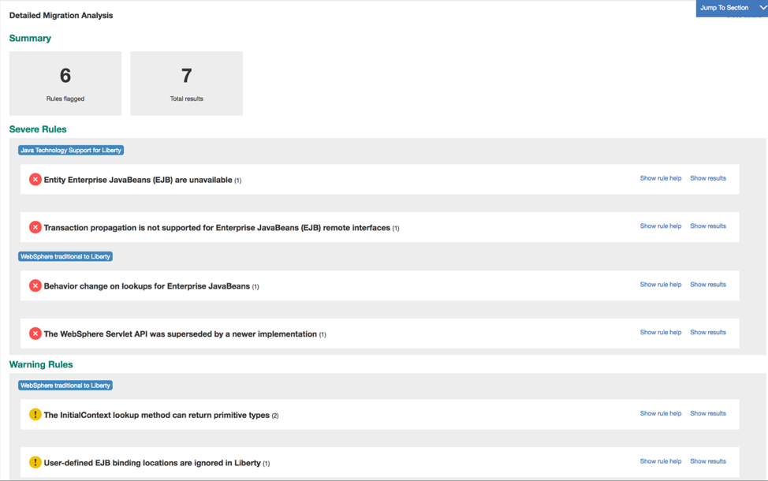

The biggest challenge for running DefaultApplication on Liberty is Entity EJB.  The Entity EJB Java EE specification was deprecated in favor of the Java Persistence API (JPA), and Entity EJBs are not supported on Liberty.

## Setup

This article uses Eclipse with additional tools installed. Here is what you need if you want to follow along:  
* Eclipse for Java EE Developers (I happen to be using Photon, but you can get the latest.)
* Dali Java Persistence Tools - Available from the Eclipse update site
* WebSphere Application Server Migration Toolkit - Available from Eclipse Marketplace
* WebSphere Developer Tools for Liberty - Available from Eclipse Marketplace

Before focusing on the code, we need to be able to build it. This application is currently being built using internal Ant build tools which we are not going to use going forward. We need to start by getting the code in a format that can be used by modern build tools.

## Modernizing the project and build

Modernizing applications often includes the need to modernize how they are built. The Java source is included in the EAR inside of DefaultWebApplication_src.jar and Increment_src.jar. Expanding the JAR and WAR files inside the EAR allows us to recover the deployment descriptors and JSP files.

Here is the structure of [original application source](./original):

```
me@us.ibm.com@DefaultApplication original (master) $ tree .
.
├── database
│   └── DefaultDB.zip
├── dd
│   ├── DefaultWebApplication
│   │   ├── META-INF
│   │   │   └── persistence.xml
│   │   ├── ibm-web-bnd.xmi
│   │   ├── ibm-web-ext.xmi
│   │   └── web.xml
│   ├── Increment
│   │   ├── ejb-jar.xml
│   │   ├── ibm-ejb-jar-bnd.xmi
│   │   └── ibm-ejb-jar-ext.xmi
│   ├── application.xml
│   ├── ibm-application-bnd.xmi
│   ├── ibm-application-ext.xmi
│   └── was.policy
├── src
│   ├── DefaultWebApplication
│   │   ├── HelloPervasiveServlet.java
│   │   ├── HitCount.java
│   │   ├── SnoopServlet.java
│   │   └── com
│   │       └── ibm
│   │           └── defaultApplication
│   │               └── Increment.java
│   └── Increment
│       └── com
│           └── ibm
│               └── defaultapplication
│                   ├── Increment.java
│                   ├── IncrementBean.java
│                   ├── IncrementHome.java
│                   └── IncrementKey.java
└── web
    └── DefaultWebApplication
        ├── HelloHTML.jsp
        ├── HelloHTMLError.jsp
        ├── HelloVXML.jsp
        ├── HelloVXMLError.jsp
        ├── HelloWML.jsp
        ├── HelloWMLError.jsp
        ├── HitCount.jsp
        ├── auth_error.jsp
        ├── banner.gif
        └── index.html
```

For this example, we are using Maven. Using the Liberty EAR archetype, we can create a new project skeleton to copy the original code. liberty-archetype-ear also shows you how to build and test on a Liberty runtime.

To create the project in Eclipse, go to `File > New > Maven project` to build project structure. On the second page of the wizard, you can select the archetype to use. If the `liberty-archetype-ear` does not show up in your list, you can get the information from this repository URL: https://mvnrepository.com/artifact/net.wasdev.wlp.maven/liberty-archetype-ear.


At this point, no code changes have been made, so we created a top level DefaultApplication parent project that contains three child Maven projects that represent the original code.
* DefaultApplication-ear
* DefaultWebApplication
* Increment

The first step is to focus on creating the project structure and getting it to build with no code included. Then, we can take the source code from the folders above and drop them into the correct Maven file structure. You will find this version of the code in the [original-maven folder](./original-maven).

```
me@us.ibm.com@DefaultApplication original-maven (master) $ tree .
.
├── DefaultApplication-ear
│   ├── pom.xml
│   └── src
│       └── main
│           ├── application
│           │   └── META-INF
│           │       ├── application.xml
│           │       ├── ibm-application-bnd.xmi
│           │       ├── ibm-application-ext.xmi
│           │       └── was.policy
│           └── liberty
│               └── config
│                   └── server.xml
├── DefaultWebApplication
│   ├── pom.xml
│   └── src
│       └── main
│           ├── java
│           │   ├── HelloPervasiveServlet.java
│           │   ├── HitCount.java
│           │   └── SnoopServlet.java
│           └── webapp
│               ├── HelloHTML.jsp
│               ├── HelloHTMLError.jsp
│               ├── HelloVXML.jsp
│               ├── HelloVXMLError.jsp
│               ├── HelloWML.jsp
│               ├── HelloWMLError.jsp
│               ├── HitCount.jsp
│               ├── WEB-INF
│               │   ├── ibm-web-bnd.xmi
│               │   ├── ibm-web-ext.xmi
│               │   └── web.xml
│               ├── auth_error.jsp
│               ├── banner.gif
│               └── index.html
├── Increment
│   ├── pom.xml
│   └── src
│       └── main
│           ├── java
│           │   └── com
│           │       └── ibm
│           │           └── defaultapplication
│           │               ├── Increment.java
│           │               ├── IncrementBean.java
│           │               ├── IncrementHome.java
│           │               └── IncrementKey.java
│           └── resources
│               └── META-INF
│                   ├── ejb-jar.xml
│                   ├── ibm-ejb-jar-bnd.xmi
│                   └── ibm-ejb-jar-ext.xmi
└── pom.xml
```

In its original file structure, it wasn't easy to build the application. Now we have a good opportunity to see what we have, what's compiling, and what’s missing in order to understand the application better. We can also use the [WebSphere Application Migration Toolkit Eclipse plugin](https://developer.ibm.com/wasdev/downloads/#asset/tools-WebSphere_Application_Server_Migration_Toolkit) to view the same migration recommendations using the source code that were reported by the binary scanner.  This allows you to scan the code and directly link the issue with the code. The same help is built into the Eclipse tool that is available in the binary scanner report.

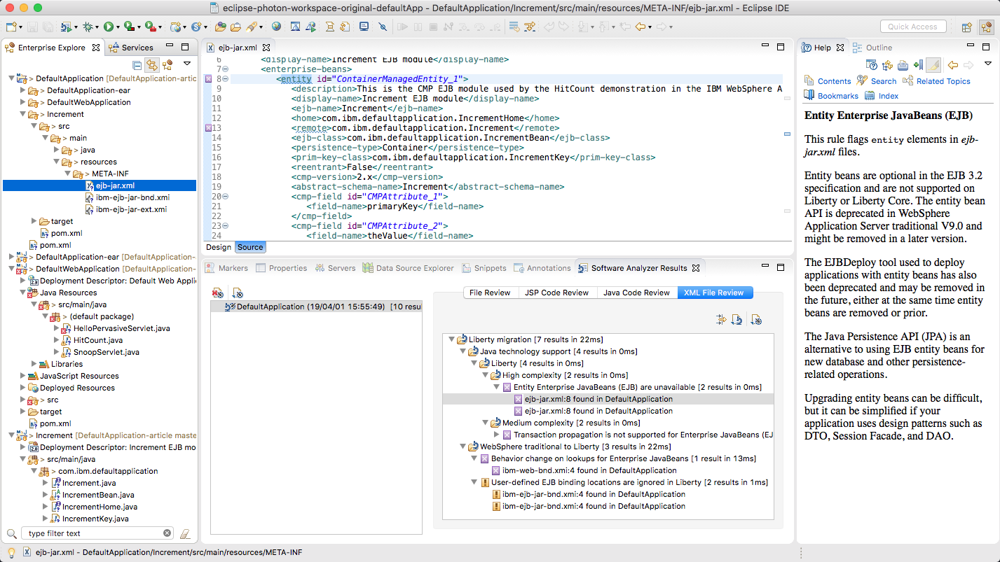


## Migrating Entity EJBs to JPA

Java Persistence API (JPA) is the recommended replacement for EJB 2.x Entity EJB Beans. The JPA Entity provides the interface to the database table. We plan to use the DefaultApplication database as-is (there is only one table), so we just needed to generate the JPA Entity class. We also chose to use a stateless session EJB as the injection mechanism for the JPA entity and to contain the application increment code for the persistence example.

The [Eclipse Dali Java Persistence Tools](https://www.eclipse.org/webtools/dali/docs/3.2/user_guide/toc.htm) are useful for creating the JPA Entity class.  Starting from the section for [Generating entities from tables](https://www.eclipse.org/webtools/dali/docs/3.2/user_guide/tasks006.htm), follow the steps to create a new JPA project using a Liberty runtime and then generate the entity from the DefaultDB. You can unzip the DefaultDB.zip found in the [original/database folder](./original/database). Refer to the Dali guides for the full details. Some Liberty-specific details are provided here.

In Eclipse, open `File > New > JPA Project` and configure the Liberty Runtime.

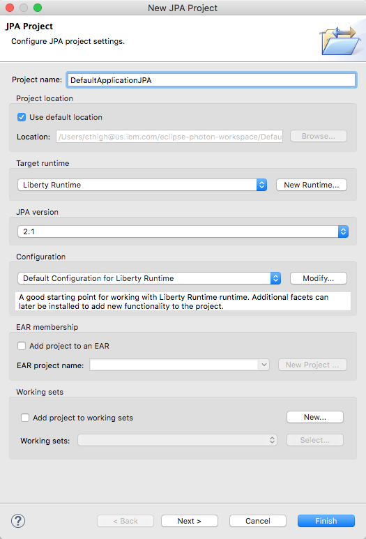

On the next page, choose to add a connection.

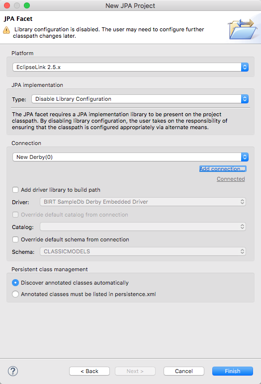

Configure a new Derby connection that points to the unzipped DefaultDB folder. You can test the connection to the database here to make sure everything is working OK.

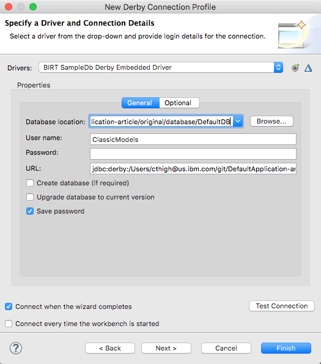

From the root of the JPA project, right click and select `JPA Tools > Generate Entities from Tables...` to create the JPA Entity:

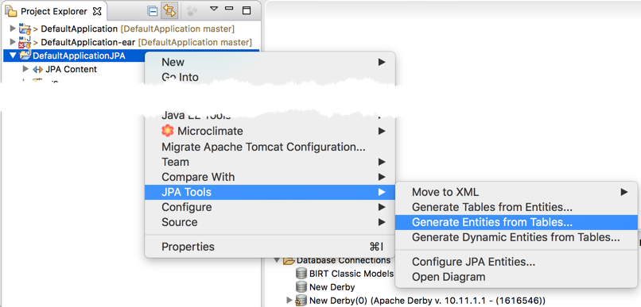

Based on the connection to the database already created, the INCREMENT table is displayed. Select it, and go through the remaining pages of the wizard. I mainly took the defaults on each page, including the package name but made a few adjustments later.

 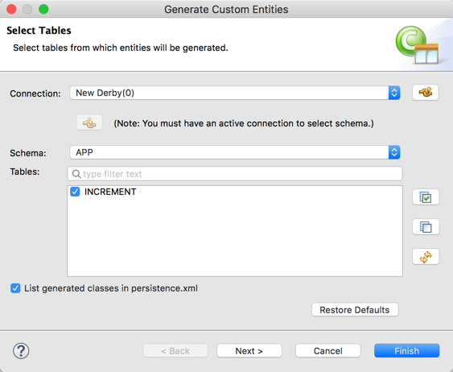

 The DefaultApplication is a simple example with only one table. The Dali tools [guide](https://www.eclipse.org/webtools/dali/docs/3.2/user_guide/tasks006.htm) goes into more detail on advanced topics such as creating table associations.

 The entity class generated with the defaults is

```
package model;

import java.io.Serializable;
import javax.persistence.*;


/**
 * The persistent class for the INCREMENT database table.
 *
 */
@Entity
@NamedQuery(name="Increment.findAll", query="SELECT i FROM Increment i")
public class Increment implements Serializable {
	private static final long serialVersionUID = 1L;

	private String primarykey;

	private int thevalue;

	public Increment() {
	}

	public String getPrimarykey() {
		return this.primarykey;
	}

	public void setPrimarykey(String primarykey) {
		this.primarykey = primarykey;
	}

	public int getThevalue() {
		return this.thevalue;
	}

	public void setThevalue(int thevalue) {
		this.thevalue = thevalue;
	}

}
```

We eventually changed the Java package name and added the `@Id` annotation for the primary key. Also, we put this entity class in the DefaultWebApplication web module. You can find the source code [here](./modernized/DefaultWebApplication/src/main/java/com/ibm/defaultapplication/Increment.java).

The generated [persistence.xml](./modernized/DefaultWebApplication/src/main/resources/META-INF/persistence.xml) defines the persistence data source as well as the entity class names.

In the same package with Increment.java, we added a stateless session bean [IncrementSSB.java](./modernized/DefaultWebApplication/src/main/java/com/ibm/defaultapplication/IncrementSSB.java). Using a stateless session bean allowed us to isolate the increment logic expected by the HitCount servlet that was previously contained in the entity EJB.

Using the Increment JPA Entity and the IncrementSSB, we have eliminated the Entity EJB classes.

## Transaction propagation

At this phase, we have also eliminated the migration report warning that `Transaction propagation is not supported for Enterprise JavaBeans (EJB) remote interfaces` since we no longer have a remote EJB.

The original program was not using remote transactions, but the binary scanner can only tell that the remote interface is being provided and that transactions are supported. It cannot tell that the capability is not being used by any application client.

## Behavior change on lookups for Enterprise JavaBeans

The migration report also indicates there is an issue with jndiName found in the ibm-web-bnd.xmi file:

```
  <ejbRefBindings xmi:id="EjbRefBinding_1" jndiName="Increment">
    <bindingEjbRef href="WEB-INF/web.xml#EjbRef_1"/>
  </ejbRefBindings>
```

Hitcount.java had the following reference:

```
   if (namespace.equals("LCL"))
   {
      lookupString = "java:comp/env/Increment";
   }
   else
   {
      lookupString = "Increment";
   }

   homeObject = ic.lookup(lookupString);
```

In the new code, we simply inject the EJB reference rather than performing a lookup:

```
   @EJB
   private IncrementSSB inc;
```

If we had continued to use lookup strings, we would changed it to use a `java:[scope]` namespace (`java:global`, `java:app`, or `java:module`) as defined by the Java EE 6 specification.  

## Migrating deployment descriptors

By removing the Entity EJBs and by using annotations in the modernized code, the deployment descriptors are simplified. In this section, we will look at some of the changes made.

#### web.xml

The application still has a web.xml with security constraint definitions, but much of the content was removed when annotations were added to the servlets.  

For example, in the original [web.xml](./original/dd/DefaultWebApplication/web.xml) the `servlet` and `servlet-mapping` definitions can be removed:

```
<servlet id="Servlet_1">
   <servlet-name>Snoop Servlet</servlet-name>
   <display-name>Snoop Servlet</display-name>
   <description>This servlet returns information about the request which includes information about  existing sessions, application attributes, and request attributes.</description>
   <servlet-class>SnoopServlet</servlet-class>
   <load-on-startup></load-on-startup>
</servlet>

<servlet-mapping id="ServletMapping_1">
   <servlet-name>Snoop Servlet</servlet-name>
   <url-pattern>/snoop/*</url-pattern>
</servlet-mapping>
```

The information is added to `SnoopServlet.java` in annotations:

```
@WebServlet(name="Snoop Servlet",
            description="This servlet returns information about the request which includes information about  existing sessions, application attributes, and request attributes.",
            urlPatterns="/snoop/*")
public class SnoopServlet extends HttpServlet
```

#### ibm-application-bnd

Since the ibm-application-bnd.xmi file is short, I manually migrated the application binding file from xmi to xml format. The xmi format is understood by later versions of WebSphere and Liberty, but if we were going to modernize, we may as well update the remaining bindings file to use the newer format. In general, the deployment descriptor specification levels were updated to Jave EE 6. If you have many xmi binding files and want to update them, Rational Application Developer has tools to update WebSphere bindings and extensions XMI files to the XML format.

This is the contents of the orginal [ibm-application-bnd.xmi](./original/dd/ibm-application-bnd.xmi) file:

```
<?xml version="1.0" encoding="UTF-8"?>
<applicationbnd:ApplicationBinding xmi:version="2.0" xmlns:xmi="http://www.omg.org/XMI" xmlns:applicationbnd="applicationbnd.xmi" xmlns:common="common.xmi" xmlns:application="application.xmi" xmlns:xsi="http://www.w3.org/2001/XMLSchema-instance" xmi:id="Application_ID_Bnd">
  <appName xsi:nil="true"/>
  <authorizationTable xmi:id="AuthorizationTable_1">
    <authorizations xmi:id="RoleAssignment_1">
      <specialSubjects xmi:type="applicationbnd:AllAuthenticatedUsers" xmi:id="AllAuthenticatedUsers_1" name="AllAuthenticatedUsers"/>
      <role href="META-INF/application.xml#SecurityRole_1"/>
    </authorizations>
  </authorizationTable>
  <application href="META-INF/application.xml#Application_ID"/>
  <runAsMap xmi:id="RunAsMap_1"/>
</applicationbnd:ApplicationBinding>
```

It is replaced by the [ibm-application-bnd.xml](./modernized/DefaultApplication-ear/src/main/application/META-INF/ibm-application-bnd.xml) file:

```
<?xml version="1.0" encoding="UTF-8"?>
<application-bnd xmlns:xsi="http://www.w3.org/2001/XMLSchema-instance"
      xsi:schemaLocation="http://websphere.ibm.com/dxml/ns/javaee http://websphere.ibm.com/xml/ns/javaee/ibm-application-bnd_1_2.xsd"
      xmlns="http://websphere.ibm.com/xml/ns/javaee" version="1.2">
      <security-role name="All Role">
          <special-subject type="ALL_AUTHENTICATED_USERS" />
      </security-role>
</application-bnd>
```

#### beans.xml

You will notice that we added an empty beans.xml for CDI. This file is not necessary with implicit bean detection available using Java EE 7, but we wanted this application to also run using the Java EE 6 stack.

```
<?xml version="1.0" encoding="UTF-8"?>
<beans xmlns="http://java.sun.com/xml/ns/javaee"
       xmlns:xsi="http://www.w3.org/2001/XMLSchema-instance"
       xsi:schemaLocation="http://java.sun.com/xml/ns/javaee http://java.sun.com/xml/ns/javaee/beans_1_0.xsd">
</beans>
```

#### ibm-web-ext

In the first update, ibm-web-ext.xmi settings were not migrated to ibm-web-ext.xml but that caused some behavior change issues. Some good and some not.

This is partial contents of the orginal [ibm-web-ext.xmi](./original/dd/DefaultWebApplication/ibm-web-ext.xmi) file:

```
<webappext:WebAppExtension xmi:version="2.0" xmlns:xmi="http://www.omg.org/XMI" xmlns:webappext="webappext.xmi" xmlns:webapplication="webapplication.xmi" xmlns:commonext.localtran="commonext.localtran.xmi" xmlns:xsi="http://www.w3.org/2001/XMLSchema-instance" xmi:id="WebApp_ID_Ext"
       reloadInterval="3"
       reloadingEnabled="true"
       fileServingEnabled="false"
       directoryBrowsingEnabled="false"
       serveServletsByClassnameEnabled="true"
       preCompileJSPs="false"
       autoRequestEncoding="false"
       autoResponseEncoding="false">
```

All the web extension setting were initially left out of the modernized application. In particular, with `fileServingEnabled` disabled,
the index.html welcome file does not work as expected. The initial delivery of DefaultApplication.ear in 9.0.0.11 allowed file serving.
The application worked as expected, but since it has a context root of "/", it caused the WebSphere plugin in IHS to send anything under the context root to WebSphere instead of handling it by IHS. An alternative would have been to change the context root of DefaultApplication to be something other than "/". But for now, it behaves as it did in previous releases from a file serving point of view.

In WebSphere 9.0.5, the [ibm-web-ext.xml](./modernized/DefaultWebApplication/src/main/webapp/WEB-INF/ibm-web-ext.xml) file is being added:

```
<?xml version="1.0" encoding="UTF-8"?>
<web-ext xmlns:xsi="http://www.w3.org/2001/XMLSchema-instance" xmlns="http://websphere.ibm.com/xml/ns/javaee"
    xsi:schemaLocation="http://websphere.ibm.com/xml/ns/javaee http://websphere.ibm.com/xml/ns/javaee/ibm-web-ext_1_0.xsd" version="1.0">
  <jsp-attribute name="reloadEnabled" value="true"/>
  <jsp-attribute name="reloadInterval" value="10"/>

  <reload-interval value="3"/>
  <enable-reloading value="true"/>
  <enable-file-serving value="false"/>
  <enable-directory-browsing value="false"/>
  <enable-serving-servlets-by-class-name value="true" />
  <pre-compile-jsps value="false"/>  
  <auto-encode-requests value="false"/>
  <auto-encode-responses value="false"/>
</web-ext>
```

## The WebSphere Servlet API was superseded by a newer implementation

The migration scan also reported that `The WebSphere Servlet API was superseded by a newer implementation`. Indeed the Hello servlet made use of the `com.ibm.servlet.PageListServlet` classes that are not available in Liberty.

Sometimes when you modernize your applications, you have to prune the parts that provide little value. This section of the application was showcasing a WebSphere deprecated, proprietary API and the use does not follow modern best practices, so we removed it. There are plenty of Hello examples already available.

## Other issues

During the course of the modernization, other issues were found and fixed along the way.

For example, the `error-page` configuration for `location` needed a leading slash to be found properly.

Originally, the code looks like:

```
    <error-page id="ErrorPage_1">
        <error-code>401</error-code>
        <location>auth_error.jsp</location>
    </error-page>
```

The slash was added before `auth_error.jsp`. Without it, the JSP file is not found.

```
    <error-page id="ErrorPage_1">
        <error-code>401</error-code>
        <location>/auth_error.jsp</location>
    </error-page>
```

This was a problem with the existing application on both traditional WebSphere and Liberty. In the error case, a generic 401 error was being displayed instead of the `auth_error.jsp`.

## Final Code

Take a look at the final code in the [modernized folder](./modernized). Here is the code structure after all the updates were made:

```
cthigh@us.ibm.com@Cindys-MacBook-Pro modernized (master) $ tree .
.
├── DefaultApplication-ear
│   ├── pom.xml
│   └── src
│       ├── main
│       │   ├── application
│       │   │   └── META-INF
│       │   │       ├── application.xml
│       │   │       ├── ibm-application-bnd.xml
│       │   │       └── was.policy
│       │   ├── liberty
│       │   │   └── config
│       │   │       └── server.xml
│       │   └── resources
│       │       └── DefaultDB.zip
│       └── test
│           └── java
│               └── wasdev
│                   └── DefaultApplication
│                       └── it
│                           └── EndpointIT.java
├── DefaultWebApplication
│   ├── pom.xml
│   └── src
│       └── main
│           ├── java
│           │   ├── HitCount.java
│           │   ├── SnoopServlet.java
│           │   └── com
│           │       └── ibm
│           │           └── defaultapplication
│           │               ├── Increment.java
│           │               └── IncrementSSB.java
│           ├── resources
│           │   └── META-INF
│           │       └── persistence.xml
│           └── webapp
│               ├── HitCount.jsp
│               ├── META-INF
│               │   └── MANIFEST.MF
│               ├── WEB-INF
│               │   ├── beans.xml
│               │   ├── ibm-web-ext.xml
│               │   └── web.xml
│               ├── auth_error.jsp
│               ├── banner.gif
│               └── index.html
└── pom.xml
```

## Running in Liberty

To see the application build and run in Liberty, import the code found in the [modernized](./modernized) folder to Eclipse as an existing Maven project.

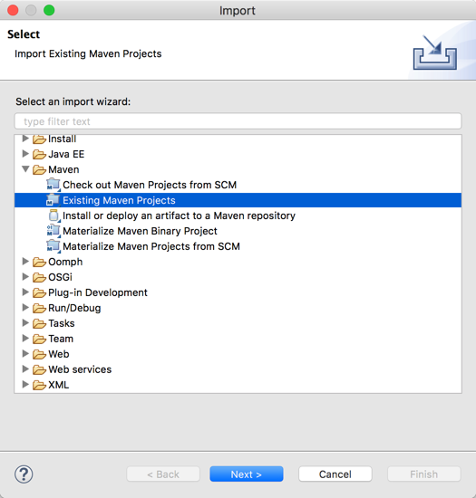

If you have the WebSphere Developer Tools for Liberty installed, the project will be recognized as a Liberty project, and you will be prompted to create the Liberty runtime.

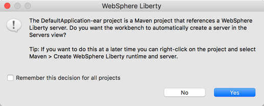

Select `Yes` and continue importing the project.  The Maven build will run automatically. It downloads Liberty, builds the EAR, deploys the application to Liberty, and runs the test.

Go to the `Servers` view and right click `DefaultApplication-ear` to start the server. In the Eclipse console view, use the link in the message `[AUDIT   ] CWWKT0016I: Web application available (default_host): http://localhost:9080/` to open the application.

If you click Snoop Servlet, you will be prompted for a user name and password the first time. A sample user name and password are configured in the [server.xml](./modernized/DefaultApplication-ear/src/main/liberty/config/server.xml).

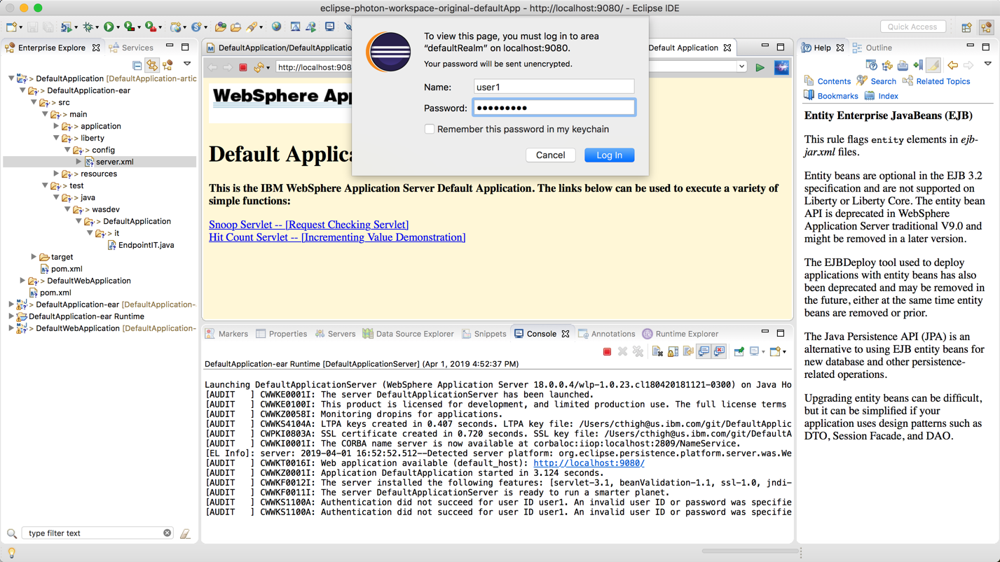

If you also click the `Hit Count Servlet` link, you can experiment calling the Increment counter using JPA Persistence.

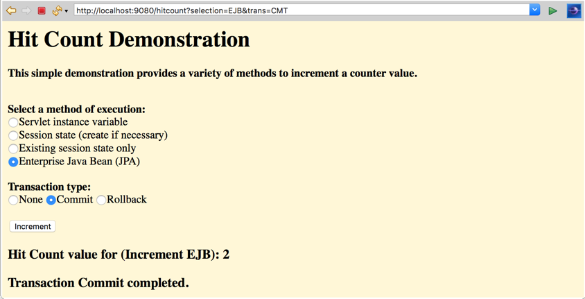

## Summary

EJB isn't what is used to be - and that's a good thing. Using EJB 3, JPA, annotations, and injection, the DefaultApplication was made much simpler and easier to use and understand. You can add EJB code to web modules without requiring an EJB JAR.

It might not be possible to modernize all of your applications, and you might be thinking "if it's not broken, why fix it?" Incremental changes that simplify your applications and thus reduce your support costs is worth considering. Also, we are sure you will love using Liberty.

As this example shows, modernizing applications means multiple things. You can modernize how you build it, how you write it, and where you run it.

If you want to see other application samples for Liberty, check out these GitHub organizations: https://github.com/WASdev/ and https://github.com/openliberty.
